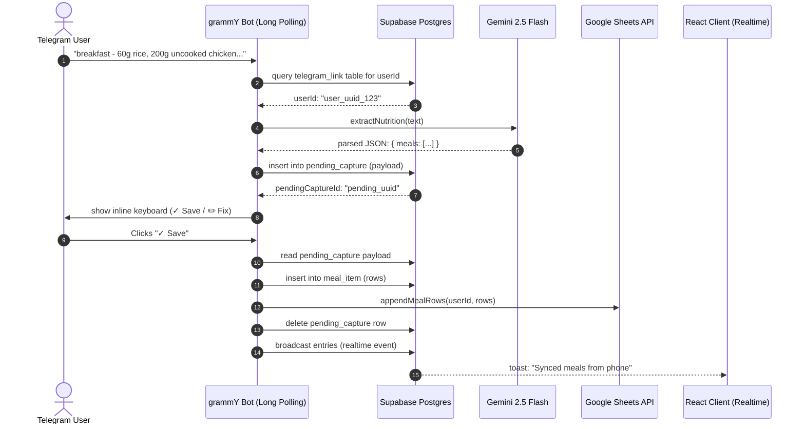

# Nutrition Data Flow

This document details the end-to-end nutrition data flow of the Calorie Tracker application, tracing a meal text log from Telegram to database and sheet persistence.

---

## 1. End-to-End Data Flow

### Flow Breakdown & Code References

#### 1. Message Enters Telegram
- **Entry point**: [lib/telegram.ts](file:///c:/Users/Atharva%20Patil/Documents/projects/ai-automation/data-demo/lib/telegram.ts#L144) listener `bot.on("message:text")` intercepting incoming text logs.

#### 2. Telegram User Resolves to Application User
- **Code**: `userIdForTelegram(tgId)` in `lib/telegram.ts#L38-L47` queries the `telegram_link` table.
- **Verification**: If no link is found, a nudge message is returned prompting account linking.

#### 3. Message/Date/Meal Hints are Parsed & Model Request Built
- **Code**: `extractNutrition(text)` in [lib/nutrition.ts](file:///c:/Users/Atharva%20Patil/Documents/projects/ai-automation/data-demo/lib/nutrition.ts#L90) triggers `generateObject()`.
- **System Instructions**: The system prompt (`NUTRITION_SYSTEM`) instructs the model to group foods by meal type (e.g. `morning` -> `Breakfast`, `lunch` -> `Lunch`) and parses out hints for date assumptions.

#### 4. Model Response Validation & Assumptions
- **Zod Schema**: `nutritionSchema` in `lib/nutrition.ts#L55` parses and validates the response structure.
- **Normalization**: `z.preprocess()` helpers in `lib/nutrition.ts#L5-L22` and `L34-L42` auto-map legacy or alternate field names (e.g. `weight` -> `grams`, `protein` -> `protein_g`) and default missing macros to `0` instead of failing.
- **Indian-food Rules**: `NUTRITION_SYSTEM` handles portion estimation rules (e.g. 1 roti ≈ 30g, 1 boiled egg ≈ 50g) and raw-vs-cooked chicken macro adjustments.

#### 5. Pending Confirmation Storage
- **Code**: `presentNutritionConfirm()` in `lib/telegram.ts#L81` writes the raw parsed `NutritionResult` into the `pending_capture` table as a JSONB payload.
- **User Action**: The bot replies with a formatted markdown summary and inline button options (`✓ Save` / `✏️ Fix`).

#### 6. Save/Fix Callbacks Handled
- **Fix Callback**: `bot.callbackQuery(/^edit:(.+)$/)` in `lib/telegram.ts#L208` drops the pending capture record and prompts the user to re-send.
- **Save Callback**: `bot.callbackQuery(/^confirm:(.+)$/)` in `lib/telegram.ts#L176` initiates the commit.

#### 7. Committing Rows to DB & Google Sheets
- **Code**: `commitNutrition(userId, nutrition, "telegram")` in [lib/commit.ts](file:///c:/Users/Atharva%20Patil/Documents/projects/ai-automation/data-demo/lib/commit.ts#L11).
- **Date Resolution**: Solves date grouping by checking the current time in `Asia/Kolkata` timezone (`todayIST()` helper).
- **Postgres Write**: Inserts multiple records into the `meal_item` database table.
- **Google Sheets Write**: `appendMealRows(userId, rows)` in `lib/sheets-sync.ts#L85` appends rows to the connected spreadsheet.

#### 8. Realtime Broadcast Event
- **Code**: `broadcastEntries(userId, rows)` in `lib/realtime.ts#L3` posts to Supabase's realtime broadcast endpoint.
- **Client Toast**: The browser channel listener catches the event, pushes the new rows to the UI state, and displays a success notification without requiring a page refresh.

---

## 2. Inconsistencies & Convergence

### Converged Commit Path
- Currently, both the `/api/extract` POST endpoint (used for web inputs) and the Telegram Bot Save confirmation callback use **different** commit functions!
  - Telegram save calls `commitNutrition()` from `lib/commit.ts`.
  - The web input API route `/api/extract` uses the legacy `appendRows()` and `db.insert(entries)` orders pipeline.
- **CRITICAL REQUIREMENT**: The next agent must align the web-entered meals so that they converge on the same canonical `commitNutrition()` function. This ensures that both Web and Telegram inputs produce identical schema rows in `meal_item` and append to the `Meals` sheet tab.
