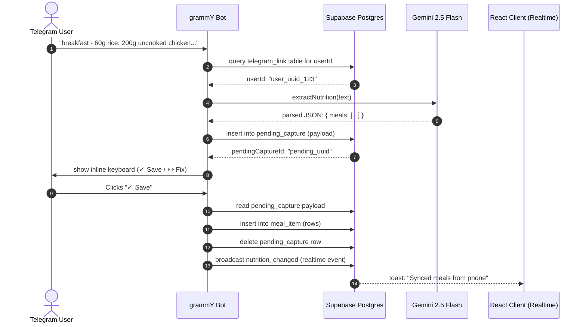

# Nutrition Data Flow

This document traces a meal log end to end — from a Telegram message or a web
submission, through extraction, to persistence in Postgres.

> **Accuracy note (1 Aug 2026).** This document previously described a Google
> Sheets write step and claimed the web and Telegram paths used different commit
> functions. Neither is true any more: the Sheets backend was deleted in PR #34,
> and both entry points converge on `commitNutrition()`. The stale sections have
> been rewritten rather than deleted, so the history stays legible.

---

## 1. End-to-End Data Flow

```mermaid
sequenceDiagram
    autonumber
    actor User as Telegram User
    participant Bot as grammY Bot
    participant DB as Supabase Postgres
    participant LLM as Gemini 2.5 Flash
    participant Client as React Client (Realtime)

    User->>Bot: "breakfast - 60g rice, 200g uncooked chicken..."
    Bot->>DB: query telegram_link table for userId
    DB-->>Bot: userId: "user_uuid_123"
    Bot->>LLM: extractNutrition(text)
    LLM-->>Bot: parsed JSON: { meals: [...] }
    Bot->>DB: insert into pending_capture (payload)
    DB-->>Bot: pendingCaptureId: "pending_uuid"
    Bot->>User: show inline keyboard (✓ Save / ✏️ Fix)
    User->>Bot: Clicks "✓ Save"
    Bot->>DB: read pending_capture payload
    Bot->>DB: insert into meal_item (rows)
    Bot->>DB: delete pending_capture row
    Bot->>DB: broadcast nutrition_changed (realtime event)
    DB-->>Client: toast: "Synced meals from phone"
```

### Flow Breakdown & Code References

Line numbers are omitted deliberately — they went stale faster than the prose.
Search for the named symbol instead.

#### 1. Message Enters Telegram

- **Entry point**: the `bot.on("message:text")` listener in
  [`lib/telegram.ts`](../lib/telegram.ts).

#### 2. Telegram User Resolves to Application User

- **Code**: `userIdForTelegram(tgId)` queries the `telegram_link` table.
- **Verification**: if no link is found, a nudge message prompts the user to
  connect their account from the web app.

#### 3. Date Hints Parsed, Model Request Built

- **Code**: `parseTelegramDate()` pulls "yesterday", `YYYY-MM-DD`, or "on 14
  March" out of the message and returns the remaining text, so the meal is
  logged against the intended day rather than today.
- **Code**: `extractNutrition(text)` in [`lib/nutrition.ts`](../lib/nutrition.ts)
  triggers `generateObject()`.
- **System instructions**: `NUTRITION_SYSTEM` groups foods by meal type
  (`morning` → Breakfast, `lunch` → Lunch) and carries the portion heuristics.

#### 4. Model Response Validation & Assumptions

- **Zod schema**: `nutritionSchema` parses and validates the response structure.
- **Normalization**: `z.preprocess()` helpers auto-map alternate field names
  (`weight` → `grams`, `protein` → `protein_g`) and default missing macros to
  `0` instead of failing the whole extraction.
- **Indian-food rules**: `NUTRITION_SYSTEM` carries portion estimation rules
  (1 roti ≈ 30g, 1 boiled egg ≈ 50g) and raw-vs-cooked chicken adjustments.

#### 5. Pending Confirmation Storage

- **Code**: `presentNutritionConfirm()` writes the parsed `NutritionResult` into
  `pending_capture` as a JSONB payload, along with the resolved `logDate`.
- **User action**: the bot replies with a Markdown summary and inline buttons
  (`✓ Save` / `✏️ Fix`).

#### 6. Save/Fix Callbacks Handled

- **Fix callback**: `bot.callbackQuery(/^edit:(.+)$/)` drops the pending capture
  and asks the user to re-send.
- **Save callback**: `bot.callbackQuery(/^confirm:(.+)$/)` re-validates the
  stored payload with `nutritionSchema` before committing — a payload written by
  an older deployment cannot corrupt current rows.

#### 7. Committing Rows to Postgres

- **Code**: `commitNutrition({ userId, nutrition, source, captureId, logDate })`
  in [`lib/commit.ts`](../lib/commit.ts).
- **Date resolution**: uses the caller's `logDate` when supplied, otherwise
  `localDate(timezone)`.
- **Postgres write**: inserts into `meal_item` with `onConflictDoNothing()`. The
  partial unique index on `(user_id, capture_id, item_index)` absorbs a
  double-tapped Save button instead of throwing, so `rowCount === 0` means
  "already saved", not "failed".
- **Trial start**: the first successfully committed meal moves a `pre_trial`
  user into `trial`.

#### 8. Realtime Broadcast Event

- **Code**: `broadcastNutritionChanged(userId, payload)` in
  [`lib/realtime.ts`](../lib/realtime.ts) posts to Supabase's realtime broadcast
  endpoint. It is fired with `void` — a broadcast failure must never fail a
  commit that already succeeded.
- **Client toast**: the browser channel listener pushes new rows into UI state
  and shows a notification without a page refresh.

---

## 2. Commit Path Convergence (resolved)

This section used to record a real defect: the web path wrote through a legacy
`appendRows()` + `db.insert(entries)` pipeline while Telegram used
`commitNutrition()`, so the two produced different rows.

**That divergence is gone.**

- The legacy `/api/extract` route was deleted (task D-1).
- The web path now posts to `/api/nutrition/day`, whose `POST` calls
  `commitNutrition()` and returns its result verbatim.
- Telegram's Save callback calls the same `commitNutrition()`.
- The `entry` and `sheet_connection` tables were dropped by
  `0007_drop_legacy_tables` (task D-2).

`lib/commit.ts` is now the single write path into `meal_item`. Anything that
needs to create meal rows should call it rather than inserting directly — that
is what keeps idempotency, trial-start, and the realtime broadcast consistent
across entry points.

### Still worth knowing

- `meal_item.capture_id` is only set when a commit originates from a pending
  capture. Web commits pass no `captureId`, so they are **not** protected by the
  idempotency index. A double-submitted web form can duplicate rows. Tracked in
  the implementation plan alongside S-1.
- `commitNutrition` validates with `nutritionSchema` again on entry even though
  callers have usually already validated. This is intentional: it is the last
  gate before the database.
